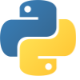
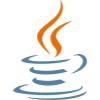
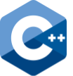
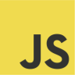
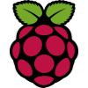

***Hi, I am Abhimanyu, a 15 year-old with a lot of experience in programming and hardware.***

 - _I am a programming member and the human player for FRC team 1360 Orbit Robotics_
 - _I am an FLL coach for team 60977 as part of the Halton Stem Club_

__________________________________________________________________________

**Languages:**

    

__________________________________________________________________________

**Tools/Frameworks:**

  

//Raspberry Pi, Linux, Solidworks, Fusion 360, Blendr, Wpilib, VSCode, Eclipse, IntelliJ, JavaFX, Prusa Slicer, Rev Hardware Client
