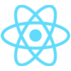
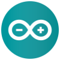

## About Me:

***Hi, I am Abhimanyu, a 15 year-old with a lot of experience in programming and hardware.***

 - _I am a programming member and the human player for FRC team 1360 Orbit Robotics_
 - _I am an FLL coach for team 60977 as part of the Halton Stem Club_
 - _I enjoy making projects in my free time_
 - _Feel free to reach out to me for questons or projects!_ 😊

__________________________________________________________________________

## Languages:

       

__________________________________________________________________________

## Interests:

   

__________________________________________________________________________

## Tools/Frameworks:

         

